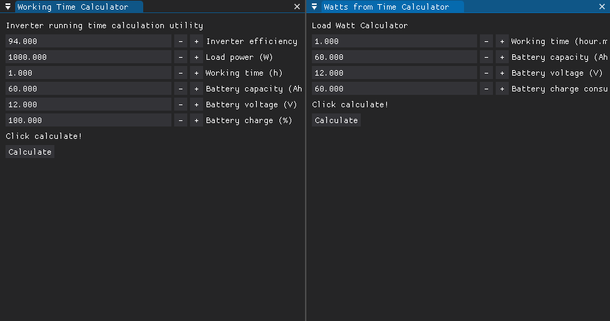

# Inverter Energy Monitor

    

## Russian

### IEM - маленькая утилита, предназначенная для удобного расчета формул инвертора. С помощью этой утилиты вы можете быстро определить время работы системы на основе заданного ваттажа потребления и времени отработки.
### Запуск утилиты
* Утилита не требует ничего особенного для запуска.
* Просто откройте скачанный релиз
### Сборка
* Установите все библиотеки `requirements.txt`
* `build.bat` - запустите и все соберется
* Результат в `./dist`

## English

### IEM is a small utility designed for easy calculation of inverter formulas. With this utility, you can quickly determine the system run time based on the specified wattage consumption and run time.
### Run utility
* The utility does not require anything special to run.
* Simply open the downloaded release
### Assembly
* Install all libraries `requirements.txt`
* `build.bat` - run and everything will build
* Result in `./dist`

